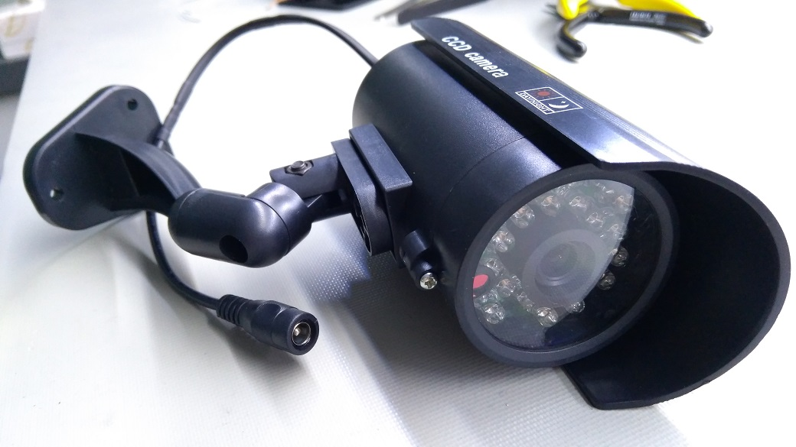

# Raspberry Pi based security camera hardware

Outdoor Raspberry Pi Zero W security camera

## Software

If you don't already have software to run on this camera, [motionEyeOS](https://github.com/jasaw/motioneyeos/releases) is a good one to try.
