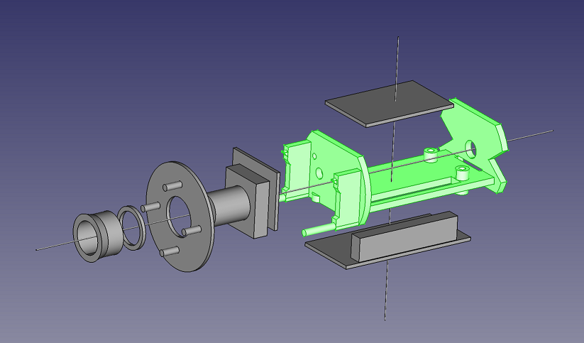
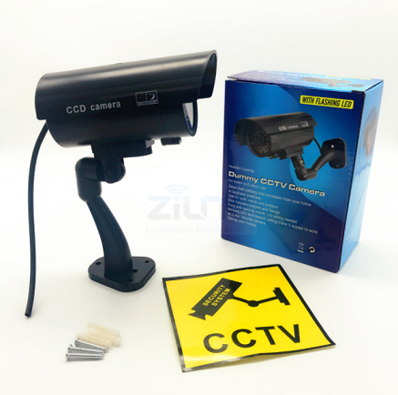
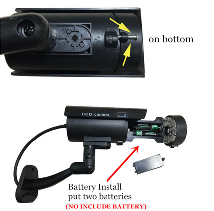

# Raspberry Pi Zero W security camera hardware

Outdoor Raspberry Pi Zero W security camera

Exploded view of the camera parts.

## Bill of Materials

* Outdoor dummy security camera:
  * 
  * Brand: zilnk
  * Model: D4
  * External dimensions: 117 x 117 x 65 mm
  * Internal dimensions: 103 x 48 mm
  * [AliExpress](https://www.aliexpress.com/item/Fake-Camera-Waterproof-Outdoor-Indoor-Security-Dummy-CCTV-Surveillance-Camera-Flashing-Rred-LED/32815686364.html)

* 3D printed camera bracket:
  * [Camera mounting bracket](bracket/README.md)

* 3D printed camera shroud:
  * [Camera shroud](bracket/camera_shroud.stl)

* 1.6mm foam tape

* Raspberry Pi NoIR Camera with IR-cut filter:
  * [AliExpress](https://www.aliexpress.com/item/Raspberry-Pi-Camera-IR-CUT-night-vision-noir-module-board-5mp-1080p-take-the-best-picture/32739395193.html)

* Raspberry Pi Zero camera FFC cable
  * [ebay](http://www.ebay.com.au/itm/New-Ribbon-FFC-Cable-Lead-Connection-Wire-For-Raspberry-Pi-Zero-V1-3-Camera/182720702738)
  * [ebay](http://www.ebay.com.au/itm/New-Ribbon-FFC-Cable-Wire-Line-Polyimide-For-Raspberry-Pi-Zero-V1-3-Camera/282571229898)

* Raspberry Pi Zero W without header

* 40-pin 0.1" pitch header for Raspberry Pi Zero W
  * Manufacturer part number: PREC020DAAN-RC
  * Digikey part number: S2012EC-20-ND
  * Alternate part number: PRPC020DAAN-RC

* microSD card

* Raspberry Pi Zero W PSU PCBA
  * [RPi Zero power supply PCBA](rpi-zero-psu/README.md)

* Camera IR-LED board
  * [IR-LED PCBA](camera-ir-led/README.md)

* 10cm 22AWG Male Female Connector JST Cable
    * [AliExpress](https://www.aliexpress.com/item/10-Pairs-100mm-10cm-Male-Female-Connector-JST-Plug-Cable-For-RC-BEC-Battery-Helicopter-DIY/32823944800.html)

* 12V DC Female Jack Connector Cable 5.5 X 2.1mm With 15CM Cable
    * [AliExpress](https://www.aliexpress.com/item/10pcs-12V-DC-Power-Plug-Female-Jack-Plug-Connector-Cable-5-5X2-1mm-With-Cord-Cable/32536715262.html)

* Minimum 12V 1A DC power supply with barrel connector
  * Barrel size: 5.5 x 2.1mm
  * [Jaycar - 12V DC 2.5A](https://www.jaycar.com.au/switchmode-mains-adaptor-12vdc-2-5a/p/MP3490)
  * [Little Bird Electronics - 12V DC 2.5A](https://www.littlebirdelectronics.com.au/switchmode-mains-adaptor-12vdc-2.5a)
  * [AliExpress - 12V DC power supply AU](https://www.aliexpress.com/item/Led-transformer-AC-110V-220V-to-12V-DC-EU-US-UK-AU-plug-Power-supply-12V/32702717419.html)
  * [AliExpress - 12V DC power supply AU](https://www.aliexpress.com/item/Power-Adapter-Supply-For-Led-Flexible-Tape-Light-AC110-220V-to-DC12V-1A-2A-3A-4A/32742445815.html)
  * [AliExpress - 12V DC power supply AU](https://www.aliexpress.com/item/LED-Driver-12V-1A-2A-3A-5A-6A-8A-10A-Power-Supply-AC-220V-to-12V/32821553829.html)

* 2 x 16mm M2.5 screws
  * [AliExpress](https://www.aliexpress.com/item/Cheap-Authentic-304-stainless-steel-Phillips-head-machine-screw-Phillips-pan-head-screws-M2-5-16/32368120946.html)

* 2 x M2.5 hex nuts
  * [AliExpress](https://www.aliexpress.com/item/Authentic-304-stainless-steel-hex-nuts-DIN934-hexagon-nut-M2-5/32359608962.html)

* 2 x 8mm M2 screws
  * [AliExpress](https://www.aliexpress.com/item/100PCS-Stainless-Steel-M2-x-8mm-Screw-Cross-Round-Head-Philips-Head-Screws-Hex-Socket-Button/32716321685.html)
  * [AliExpress](https://www.aliexpress.com/item/50x-Set-M2-Stainless-Steel-Screw-Thread-Diameter-304-8mm-2mm-Head-Shape-Cross-Screws-Round/32598285502.html)

* 2 x M2 hex nuts
  * [AliExpress](https://www.aliexpress.com/item/100pcs-din934-Stainless-Steel-304-M2-Hex-Nut/32763090222.html)

* (optional) 5.5*2.1mm DC 1 To 2 Way Jack Connector Power Splitter Cable
  * [AliExpress](https://www.aliexpress.com/item/2pcs-5-5-2-1mm-DC-1-To-2-Way-Jack-Connector-Power-Splitter-Cable-For/32845687591.html)

## Assembly Instructions

[Assembly instructions](README_assembly.md)
