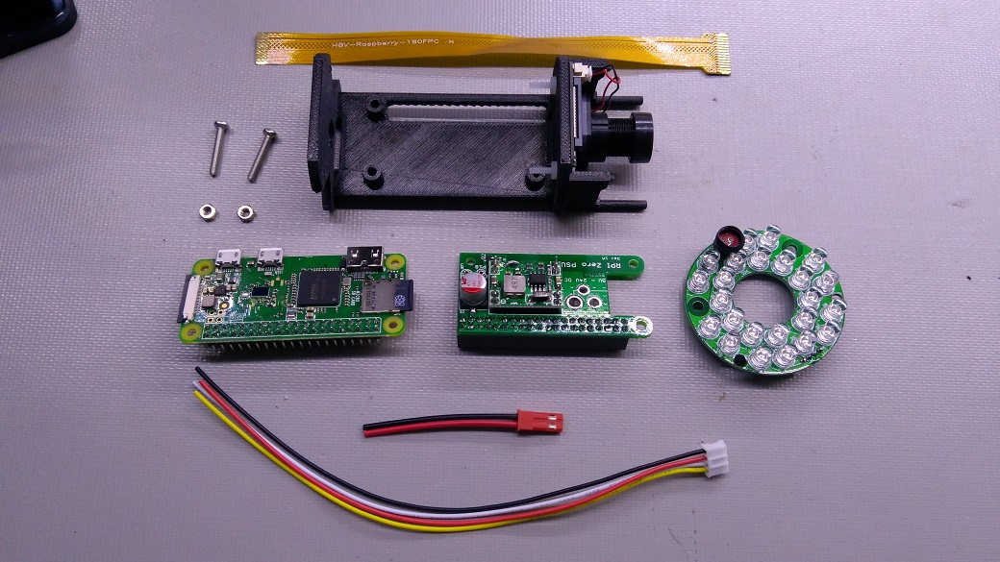
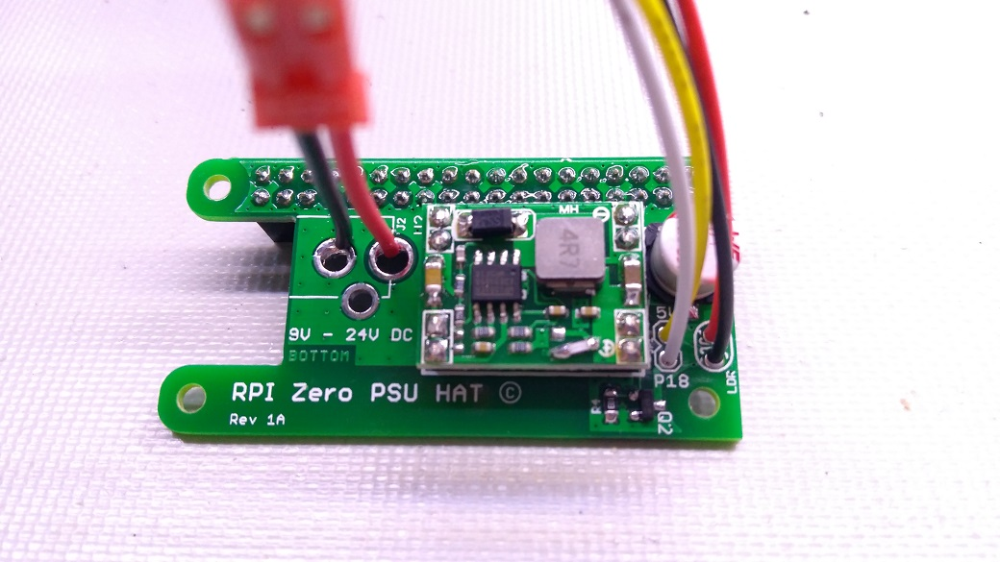
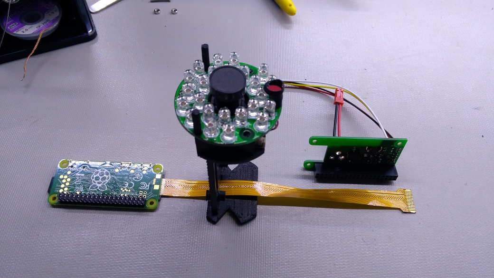
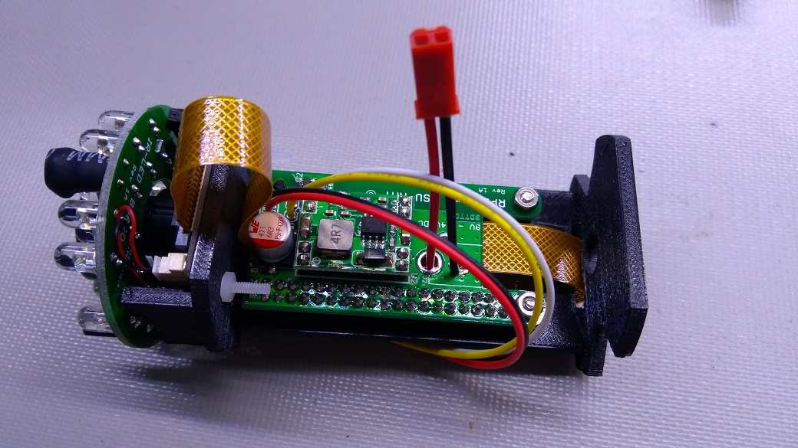
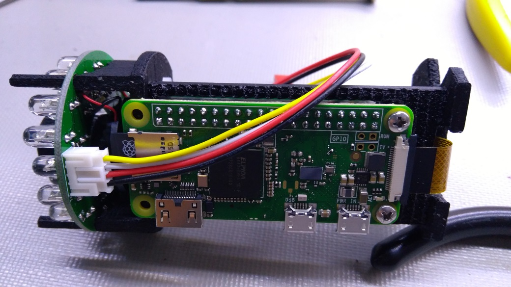
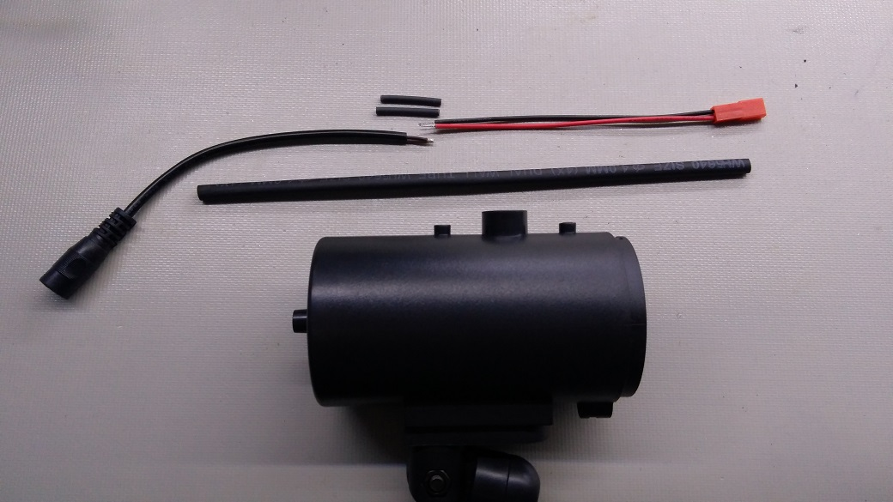
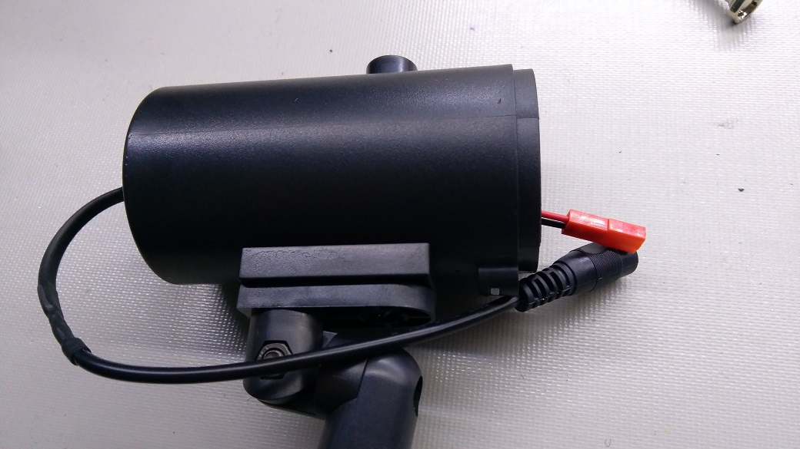

# Raspberry Pi Zero W security camera hardware assembly instructions

1. Solder a male 40-pin connector on the underside of the RPi Zero W.

2. Cut the foam tape into an O-ring shape and stick it at the bottom of the 3D printed camera shroud.

3. Mount the camera module onto the 3D printed bracket and secure it using two M2 screws and nuts.

4. Insert the IR-LED board.

5. Prepare all the parts required to install onto the 3D printed bracket.
   

6. Solder power cable and 4-wire cable onto the RPi Zero power supply PCBA.
   

7. Connect the FFC camera cable to the RPi Zero W and loop it through the bracket.
   

8. Connect the FFC camera cable to the camera module. Mount the RPi Zero W and power supply PCBA together with the 3D printed bracket in between. Secure the boards using two M2.5 screws and nuts.
   

9. Connect the 4-wire cable to the IR-LED board.
   

10. Disassemble the dummy camera and prepare the cables required.
    

11. Insert the heatshrink over the wires then loop the power cable through the hole at the back of the dummy camera case. Solder the power cables together and use heatshrink over the cable.
    

12. Insert the assembled 3D printed bracket into the dummy camera case, insert the camera shroud, and close it. Done.
    
