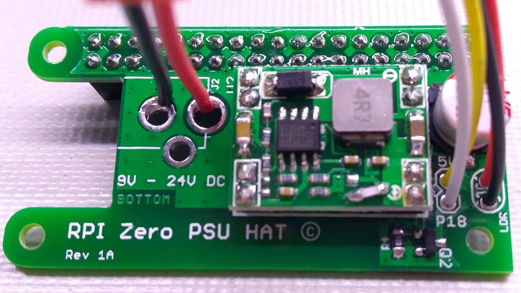
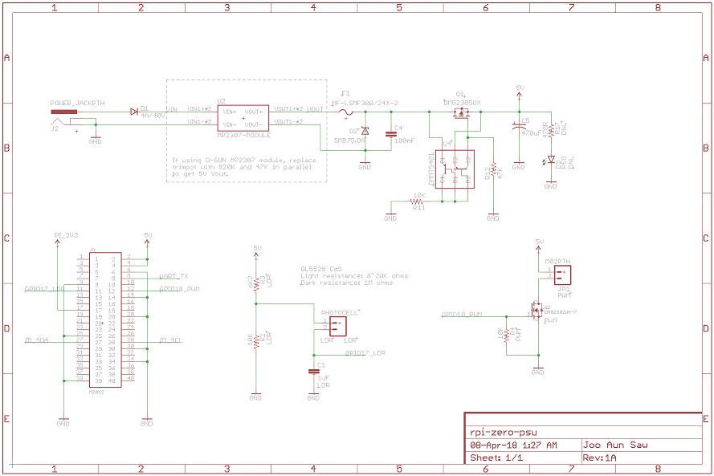
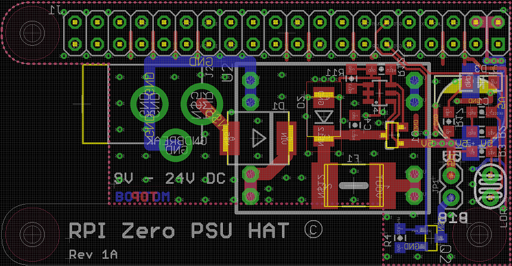

# Raspberry Pi Zero power supply

Power supply board that plugs directly onto a Raspberry Pi Zero (W)

Features:
* Input: 9V to 24V DC
* Output: 5V 3A to the RPi
* Basic light sensor circuit ([LDR reader software here](https://github.com/jasaw/ldr-reader))
* One GPIO controlled output (5V 1A)

### Design files

* [Gerbers](rpi-zero-psu-rev-1a.zip)
* [PCB top](rpi-zero-psu-rev-1a-top.pdf)
* [PCB bottom](rpi-zero-psu-rev-1a-bottom.pdf)

### Bill of Materials

* [BoM](rpi-zero-psu-rev-1a-bom.pdf)
* 3A XM1584 DC-DC step-down module can be sourced from other places:
  * [Seeed Studio](https://www.seeedstudio.com/Adjustable-Step-Down-DC%26DC-Converter-%280.8V-18V%263A%29-p-1716.html)
  * [AliExpress](https://www.aliexpress.com/item/Free-Shipping-5PCS-XM1584-Ultra-small-size-DC-DC-step-down-power-supply-module-3A-adjustable/32262690691.html)
  * [AliExpress](https://www.aliexpress.com/item/10pcs-lot-Ultra-Small-Size-DC-DC-Step-Down-Power-Supply-Module-3A-Adjustable-Step-Down/32478748937.html)

